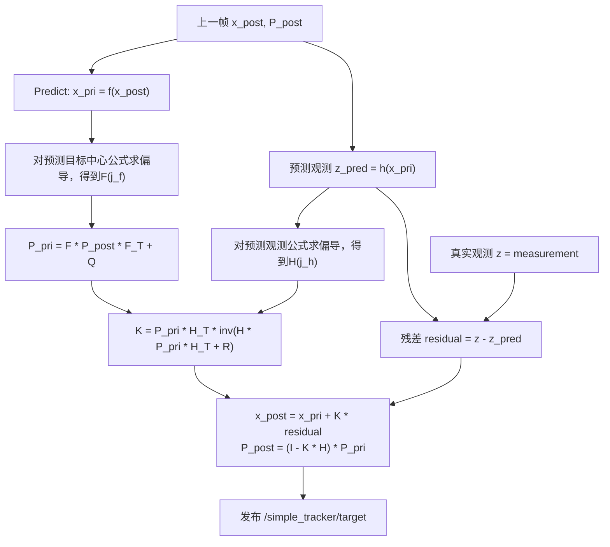

# RoboMaster 自瞄视觉算法复现技术报告

## 1. 项目背景

本项目基于 Ubuntu 22.04、ROS 2 Humble 和 OpenCV，围绕 RoboMaster 开源视觉项目 `rm_auto_aim` / `rm_vision` 进行复现。由于当前没有实体小车、工业相机、云台和电控设备，因此本项目的目标不是完整上车，而是在普通摄像头或 MP4 视频输入条件下，复现自瞄视觉前端的核心算法链路。

最终实现的主线为：

```text
MP4 / 普通摄像头
        ↓
虚拟相机节点
        ↓
/image_raw + /camera_info
        ↓
手写 simple_armor_detector
        ↓
/simple_detector/armors
        ↓
simple_armor_interfaces
        ↓
手写 simple_armor_tracker
        ↓
/simple_tracker/target
```

本项目的重点不是简单运行官方代码，而是在理解官方模块结构的基础上，手动复现一套适合无硬件条件下运行的自瞄视觉算法流程，包括虚拟图像输入、装甲板检测、PnP 位姿解算、自定义接口传递以及官方风格 EKF tracker 输出目标状态。

---

## 2. 项目主体结构

项目主体代码结构如下，仅列出核心功能包和主要源码文件：

```text
rm_ws/
├── src/
│   ├── my_vision_node/
│   │   ├── src/
│   │   │   ├── vision_node.cpp              # 读取摄像头/MP4，发布 /image_raw
│   │   │   └── camera_info_node.cpp         # 发布 /camera_info
│   │
│   ├── simple_armor_interfaces/
│   │   ├── msg/
│   │   │   ├── Light.msg                    # 灯条结构化信息
│   │   │   ├── SimpleArmor.msg              # 单个装甲板信息
│   │   │   ├── SimpleArmors.msg             # 一帧中的装甲板数组
│   │   │   └── SimpleTarget.msg             # tracker 输出的目标状态l
│   │
│   ├── simple_armor_detector/
│   │   ├── include/simple_armor_detector/
│   │   │   ├── armor.hpp                    # Light / SimpleArmor 内部结构
│   │   │   ├── detector.hpp                 # 图像检测算法声明
│   │   │   ├── pnp_solver.hpp               # PnP 位姿解算声明
│   │   │   └── simple_detector_node.hpp     # ROS 2 节点声明
│   │   ├── src/
│   │   │   ├── detector.cpp                 # 二值化、灯条检测、装甲板匹配
│   │   │   ├── pnp_solver.cpp               # PnP 解算 rvec/tvec
│   │   │   └── simple_detector_node.cpp     # 订阅图像并发布结果
│   │
│   ├── simple_armor_tracker/
│   │   ├── include/simple_armor_tracker/
│   │   │   ├── extended_kalman_filter.hpp   # EKF
│   │   │   ├── tracker.hpp                  # Tracker 状态机与算法声明
│   │   │   └── tracker_node.hpp             # ROS 2 tracker 节点声明
│   │   ├── src/
│   │   │   ├── extended_kalman_filter.cpp   # EKF predict/update 实现
│   │   │   ├── tracker.cpp                  # 目标匹配、状态机、armor jump
│   │   │   └── tracker_node.cpp             # 订阅 armors，发布 target/marker
│   │
│   ├── rm_auto_aim/                         # 官方自瞄核心仓库，用于阅读和对照
│   └── rm_vision/                           # 官方 bringup / config 参考
```

---

## 3. 整体算法框架

本项目算法框架分为四层：

```text
输入层
  ↓
检测层
  ↓
接口层
  ↓
跟踪层
```

### 3.1 输入层：虚拟相机与 camera_info

官方 `rm_auto_aim` 本身不负责普通 MP4 或普通摄像头输入，而是默认由外部相机驱动发布 `/image_raw` 和 `/camera_info`。在无工业相机条件下，我自行实现了 `my_vision_node`。

`vision_node.cpp` 使用 OpenCV 的 `cv::VideoCapture` 读取普通摄像头或 MP4 视频，将每一帧 `cv::Mat` 通过 `cv_bridge` 转换为 `sensor_msgs/msg/Image` 并发布到：

```text
/image_raw
```

`camera_info_node.cpp` 发布：

```text
/camera_info
```

其中包含相机内参：

```text
fx, fy, cx, cy, K, D, R, P
```

这些参数用于后续 PnP 位姿解算。当前相机内参为近似虚拟内参，真实上车时需要重新标定。

### 3.2 检测层：simple_armor_detector

`simple_armor_detector` 是本项目手写复现的装甲板检测模块。其核心流程为：

```text
/image_raw
    ↓
B/R 通道差分
    ↓
二值化
    ↓
形态学处理
    ↓
轮廓提取
    ↓
灯条筛选
    ↓
灯条匹配为装甲板
    ↓
PnP 位姿解算
    ↓
发布检测结果
```

检测层主要输出：

```text
/simple_detector/binary_img
/simple_detector/result_img
/simple_detector/poses
/simple_detector/armors
/simple_detector/markers
```

其中，`binary_img` 用于观察二值化效果，`result_img` 用于查看灯条和装甲板绘制效果，`armors` 是传递给 tracker 的结构化检测结果。

### 3.3 接口层：simple_armor_interfaces

包括：

```text
Light.msg
SimpleArmor.msg
SimpleArmors.msg
SimpleTarget.msg
```

其中 `SimpleArmor.msg` 保存单个装甲板信息，包括：

```text
number
type
color
confidence
distance_to_image_center
四个角点
左右灯条信息
pose
has_pose
```

`SimpleArmors.msg` 表示一帧中检测到的所有装甲板，用于 detector 到 tracker 的通信；`SimpleTarget.msg` 表示 tracker 输出的目标状态，包括：

```text
tracking
id
armors_num
position
velocity
yaw
v_yaw
radius_1
radius_2
dz
```

### 3.4 跟踪层：simple_armor_tracker

包括：

```text
extended_kalman_filter
tracker
tracker_node
```

状态量为：

```text
xc, v_xc, yc, v_yc, za, v_za, yaw, v_yaw, r
```

观测量为：

```text
xa, ya, za, yaw
```

其中：

- `xa, ya, za` 表示 detector 观测到的装甲板位置；
- `xc, yc` 表示 tracker 估计出的目标中心位置；
- `yaw` 表示目标朝向；
- `r` 表示装甲板到目标中心的半径。

状态机：

```text
LOST
DETECTING
TRACKING
TEMP_LOST
```

其基本逻辑为：

```text
LOST:
  无目标状态，收到 armor 后尝试初始化 EKF

DETECTING:
  已检测到目标，但还没有连续稳定匹配

TRACKING:
  已进入稳定跟踪状态

TEMP_LOST:
  短暂丢失目标，使用预测状态维持一段时间
```

最终输出：

```text
/simple_tracker/target
/simple_tracker/marker
```

测试中已经验证 `/simple_tracker/target` 可以稳定输出 `tracking: true`，并以约 30 Hz 输出目标位置、速度、yaw、角速度和半径等状态。

### 3.5 EKF算法的推导



---

## 4. 关键问题与解决过程

### 4.1 无工业相机输入问题

官方 `rm_auto_aim` 默认依赖外部相机驱动发布 `/image_raw` 和 `/camera_info`。在没有工业相机的情况下，直接运行官方 detector 会缺少输入源。为解决该问题，我编写了 `my_vision_node`，通过 OpenCV 读取普通摄像头或 MP4 视频，并发布 ROS 2 图像话题。同时编写 `camera_info_node` 发布近似相机内参，使官方 detector 和自写 detector 都能够完成 PnP 初始化。

### 4.2 灯条误匹配问题

在灯条检测阶段，曾出现两个问题：1、跨灯条匹配   2、相邻不同对灯条错误匹配。

最开始我的思路是通过不断调整参数去实现精准匹配，后面发现由于没有numberclassify，以及旋转过程中产生的变化，只通过调整参数几乎不可能达到解决。
1、通过翻阅源码，我发现源码有一个iscontainlight的函数，可以直接通过判断匹配的灯条间是否有其他灯条来解决第一个问题
2、由于暗光条件下装甲板没有数字，所以没办法通过识别甲板数字来确定灯条是匹配的。后来我希望通过让一个灯条只能参与匹配一次来实现筛选错误匹配，而ai给出的方案是通过评分函数与贪心匹配共同完成筛选。

### 4.3 从 PoseArray 到自定义 interfaces

最初 detector 只输出 `PoseArray`，tracker 只能接收到目标三维位置。这样虽然可以实现最基础的滤波，但 tracker 无法使用 `confidence`、装甲板类型、四角点、灯条信息等数据进行进一步判断。

因此我设计了 `simple_armor_interfaces`，将 detector 内部的 `SimpleArmor` 结构体转化为 ROS 2 自定义消息。这样 tracker 可以从 `/simple_detector/armors` 中获得完整结构化信息，实现更接近官方 `auto_aim_interfaces/msg/Armors` 的通信方式。

### 4. 4yaw 接近 0 的问题

最初，`/simple_tracker/target` 中的 `yaw` 基本接近 0。排查后发现，虽然 detector 已经通过 PnP 得到了装甲板的 `rvec` 和 `tvec`，但发布 `SimpleArmor.pose` 时只将 `tvec` 写入了 `pose.position`，而 `pose.orientation` 仍被固定为单位四元数 `(0, 0, 0, 1)`，导致 tracker 从 orientation 中提取 yaw 时始终接近 0。

为解决该问题，我在 `simple_armor_detector` 中新增 `rvecToQuaternion()` 函数，使用 `cv::Rodrigues` 将 PnP 的 `rvec` 转换为旋转矩阵，再转换为 `tf2::Quaternion` 并写入 `SimpleArmor.pose.orientation`。修复后，`/simple_detector/armors` 中的 orientation 不再固定，tracker 能够从中提取 yaw，并在 `/simple_tracker/target` 中输出有效的 `yaw` 和 `v_yaw`。当前 yaw 仍处于 camera 坐标系下，尚未接入真实 odom/TF 坐标变换。

---

## 5. 对 AI 工具的利用

在本项目中，我使用 AI 工具辅助完成了代码阅读、问题定位、结构规划和文档整理，但核心实现和调试过程仍然由我在本地环境中逐步验证。ROS2的库非常大，对于一个初学者来说，熟练掌握各种函数和串口通信是非常难的，ai在这个过程中发挥了巨大的作用——通过与ai对话，我很快地了解各种函数的功能以及各种信息的格式以及传递方式；同时，适当的ai coding帮助了我对于基础功能的快速实现。

---
## 6. 编译部署流程

### 6.1 环境准备

系统环境：

```text
Ubuntu 22.04
ROS 2 Humble
OpenCV
cv_bridge
image_transport
Eigen3
tf2
tf2_geometry_msgs
```

每个终端运行前需要 source：

```bash
source /opt/ros/humble/setup.bash
source ~/rm_ws/install/setup.bash
```

### 6.2 编译流程

进入工作空间：

```bash
cd ~/rm_ws
source /opt/ros/humble/setup.bash
```

推荐先编译接口包：

```bash
colcon build --packages-select simple_armor_interfaces --symlink-install
source install/setup.bash
```

检查接口：

```bash
ros2 interface show simple_armor_interfaces/msg/SimpleArmors
ros2 interface show simple_armor_interfaces/msg/SimpleTarget
```

然后编译 detector 和 tracker：

```bash
colcon build --packages-select \
  simple_armor_detector \
  simple_armor_tracker \
  --symlink-install

source install/setup.bash
```

也可以整体编译：

```bash
colcon build --symlink-install
source install/setup.bash
```

### 6.3 启动流程

#### 终端 1：启动虚拟相机和 camera_info

```bash
cd ~/rm_ws
source /opt/ros/humble/setup.bash
source install/setup.bash

ros2 launch my_vision_node virtual_detector.launch.py
```

#### 终端 2：启动手写 detector

```bash
cd ~/rm_ws
source /opt/ros/humble/setup.bash
source install/setup.bash

ros2 launch simple_armor_detector simple_detector.launch.py
```

#### 终端 3：启动手写 tracker

```bash
cd ~/rm_ws
source /opt/ros/humble/setup.bash
source install/setup.bash

ros2 launch simple_armor_tracker simple_tracker.launch.py
```

#### 终端 4：查看结果图

查看手写 detector 结果：

```bash
ros2 run rqt_image_view rqt_image_view /simple_detector/result_img
```

查看二值图：

```bash
ros2 run rqt_image_view rqt_image_view /simple_detector/binary_img
```

### 6.4 topic 检查

检查 detector 输出：

```bash
ros2 topic echo /simple_detector/armors --once
```

检查 tracker 输出：

```bash
ros2 topic echo /simple_tracker/target --once
```

检查 tracker 频率：

```bash
ros2 topic hz /simple_tracker/target
```

---

## 7. 当前不足与后续改进

当前项目仍存在一些简化：

```text
1. 暂无数字识别
   当前 number 固定为 '0'，不能区分不同编号装甲板。

2. 暂无真实 odom/TF
   当前 tracker 工作在 camera 坐标系下，而不是官方完整系统中的 odom/world 坐标系。

3. 暂无真实工业相机标定
   camera_info 使用近似虚拟内参，实际距离和姿态精度有限。

4. 暂无云台控制、弹道预测和串口通信
   当前 /simple_tracker/target 仅用于算法验证和可视化。

5. 多目标跟踪能力有限
   由于没有数字识别，多个目标同时出现时，tracker 不能可靠区分不同编号。
```

后续可继续改进：

```text
1. 加入数字识别或至少加入简单编号策略
2. 接入真实相机标定参数
3. 加入 static TF 演示 camera → odom 的转换流程
4. 有实体车后接入真实 odom、base_link、gimbal_link、camera_link TF 树
5. 增加 simple_visualizer，将 detector 和 tracker 结果绘制到同一张图上
6. 继续优化灯条误匹配过滤策略
```

---

## 8. 总结

本项目完成了一个无实体小车、无工业相机条件下的 RoboMaster 自瞄视觉复现工程。项目不仅运行了官方 `rm_auto_aim` 中的部分模块，还自行实现了虚拟相机输入、简化装甲板检测器、自定义接口和官方风格 EKF tracker。

通过该项目，我理解并实践了 ROS 2 节点通信、自定义 msg、OpenCV 图像处理、PnP 位姿解算、四元数姿态表示、EKF 状态估计和 detector 到 tracker 的完整数据流。虽然当前项目仍未接入真实 odom、数字识别和控制链路，但已经完成了自瞄视觉前端从图像到目标状态输出的核心复现。
